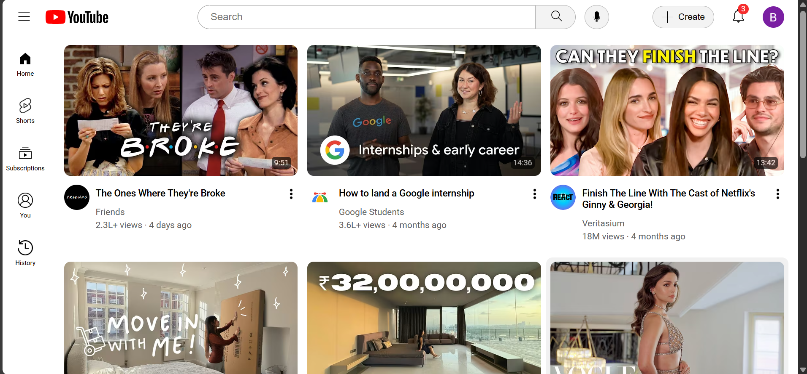

# Youtube-Clone
This is a YouTube homepage clone I made using just HTML and CSS. 
It is my first frontend project, built while learning the basics of web development.

## Live Site
Link: [YouTube Clone](https://bushrafatima0.github.io/Youtube-Clone/)

## Screenshot
 

## Features

- YouTube-style layout with thumbnails, sidebar, and video grid
- Responsive layout with fixed header and sidebar
- Subtle hover effects for a more interactive and modern UI
- Video cards with thumbnails, channel images, titles, and metadata

##Goals
Add JavaScript in the future
